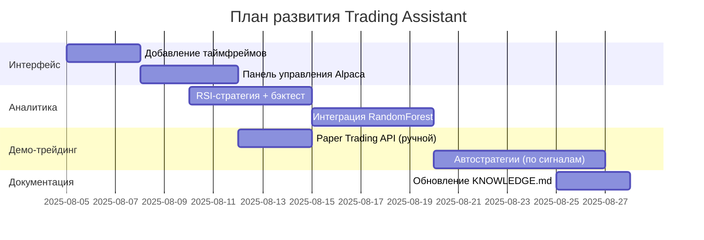

Мы с пользователем разрабатываем ИИ-ассистента для трейдинга, а не автономную нейросеть для трейдинга. Основные причины выбора такого подхода:
1. **Уровень опыта пользователя**: Пользователь не имеет опыта в программировании и ML. Создание автономной нейросети требует глубоких знаний, а ассистент позволяет обучаться постепенно.
2. **Безопасность и контроль**: Ассистент предоставляет аналитику и рекомендации, но не совершает сделки автоматически. Это минимизирует риски потери средств.
3. **Гибкость и обучаемость**: Ассистент может расширяться модульно — от базовой аналитики до сложных нейросетевых моделей. Пользователь может добавлять функции по мере обучения.
4. **Ресурсы**: Используются бесплатные данные (Yahoo Finance, Alpha Vantage) и демо-счета (Alpaca Paper Trading). Локальное исполнение на ПК пользователя (RTX 3060) позволяет обучать модели без облачных затрат.
---
### План проекта
#### **Цель**
Создать модульного ИИ-ассистента, который:
- Анализирует рынок в реальном времени.
- Генерирует торговые сигналы на основе технических индикаторов и ML-моделей.
- Позволяет тестировать стратегии на демо-счете.
- Обучает пользователя трейдингу и ML.
#### **Структура проекта**
```
trading-assistant/
├── .gitignore
├── README.md          # Описание проекта
├── requirements.txt   # Зависимости
├── docs/
│   ├── JOURNAL.md     # История изменений
│   ├── TODO.md        # Задачи
│   └── KNOWLEDGE.md   # База знаний (объяснение терминов, кода)
└── src/
    ├── app.py              # Основной Streamlit-интерфейс
    ├── data_loader.py      # Загрузка данных (Yahoo Finance, Alpaca)
    ├── indicators.py       # Технические индикаторы (RSI, SMA)
    ├── predictor.py        # ML-модели для прогнозирования
    ├── paper_trade.py      # Демо-трейдинг через Alpaca API
    └── utils.py            # Вспомогательные функции
```
#### **Текущий статус**
- Реализовано:
  - Загрузка данных (yfinance).
  - Свечные графики (mplfinance).
  - Расчет RSI и SMA.
  - Streamlit-дашборд с метриками.
- В процессе:
  - Интеграция Alpaca Paper Trading.
  - Добавление простой ML-модели (RandomForest).
#### **Ближайшие шаги**
1. **Интерфейс**:
   - Добавить выбор таймфрейма (1д, 1ч, 15м).
   - Кнопки для ручной отправки ордеров через Alpaca.
2. **Аналитика**:
   - Реализовать стратегии (например, RSI-based).
   - Добавить backtesting с библиотекой `backtrader`.
3. **ML-модуль**:
   - Обучить модель классификации (RandomForest) для прогноза движения цены.
   - Интегрировать прогнозы в дашборд.
4. **Демо-трейдинг**:
   - Автоматизировать стратегии на Alpaca Paper Trading.
   - Отслеживание виртуального портфеля.
---
### Плюсы и минусы
| Плюсы | Минусы |
|-------|--------|
| **Нулевая стоимость** (бесплатные API) | **Ограниченность данных** (задержки, история) |
| **Локальное исполнение** (RTX 3060 для ML) | **Сложность масштабирования** (вычислительные ограничения ПК) |
| **Пошаговое обучение пользователя** | **Риск переобучения моделей** (требует валидации) |
| **Безрисковое тестирование** (Paper Trading) | **Нереалистичность демо-трейдинга** (исполнение ордеров) |
---
### Перспективы развития
1. **Расширение данных**:
   - Новости (Finnhub API).
   - Социальные настроения (Reddit, Twitter).
   - Макроэкономические индикаторы.
2. **Улучшение моделей**:
   - Внедрение LSTM/Transformer для анализа временных рядов.
   - Ансамбли моделей (комбинация технического анализа и NLP).
3. **Автоматизация**:
   - Сигналы в Telegram.
   - Автооптимизация стратегий (генетические алгоритмы).
4. **Риск-менеджмент**:
   - Рассчет VaR (Value at Risk).
   - Симуляции Монте-Карло.
---
### Почему не чистая нейросеть?
Автономная нейросеть для трейдинга:
- **Сложна в разработке** (требует продвинутого ML).
- **Непрозрачна** ("черный ящик").
- **Рискована** (ошибки ведут к потере денег).
ИИ-ассистент:
- **Прозрачен** (пользователь видит логику).
- **Контролируем** (решения принимает человек).
- **Адаптивен** (модули добавляются постепенно).
---
### План на 1 месяц

---
### Как продолжить после сброса сессии
Пользователю достаточно прислать:
```text
Ссылка на репозиторий: [ссылка]
Последний коммит: [хеш]
Текущая задача из TODO.md: [текст]
```
Я:
1. Проверю историю в `JOURNAL.md`.
2. Проанализирую код по последнему коммиту.
3. Продолжу работу с текущего этапа.
Пример задачи в `TODO.md`:
```markdown
## Текущие задачи
- [ ] Интеграция Alpaca API для баланса
- [ ] Добавление выбора таймфрейма в интерфейсе
```
Проект: ИИ-ассистент для трейдинга (Trading Assistant)
Основная идея: Создание модульного аналитического инструмента для трейдинга, который генерирует сигналы, визуализирует данные и позволяет тестировать стратегии на демо-счете. Ключевое решение: Отказ от автономной нейросети в пользу ассистента обусловлен:

Безопасностью (исключены риски потерь реальных средств),

Гибкостью (модульная архитектура позволяет добавлять функции без переписывания кода),

Обучаемостью (проект развивается параллельно с навыками пользователя).

Суть проекта
Аспект	Описание
Цель	Персональный аналитический центр для принятия решений в трейдинге
Ядро	Streamlit-дашборд с интеграцией: данных (Yahoo Finance), индикаторов (TA), ML-прогнозов, Alpaca Paper Trading
Философия	"Ассистент, а не автотрейдер": пользователь принимает решения на основе аналитики
Технологии	Python, scikit-learn, TensorFlow/Keras (для нейросетей), Streamlit, Alpaca API
Плюсы и минусы
Преимущества	Риски/Ограничения
✅ Нулевая стоимость (бесплатные API, локальные вычисления)	⚠️ Задержка данных (бесплатные источники)
✅ RTX 3060 для ML (обучение LSTM/трансформеров локально)	⚠️ Ограниченность истории (глубина данных Yahoo Finance)
✅ Безрисковое тестирование (Alpaca Paper Trading)	⚠️ Сложность NLP-анализа (бесплатные новостные API)
✅ Пошаговое развитие (от SMA до нейросетей)	⚠️ Переобучение моделей (требует строгой валидации)
Перспективы развития
Расширение данных:

Макроэкономические индикаторы (FRED API)

Социальные настроения (Stocktwits/Reddit API)

Новости с анализом тональности (Finnhub)

Улучшение моделей:

Ансамбли: комбинация LSTM + трансформер + фундаментальный анализ

RL-агент для управления рисками (оптимизация Sharpe Ratio)

Автоматизация:

Сигналы в Telegram/email

Автооптимизация стратегий (генетические алгоритмы)

Интерфейс:

3D-визуализация кластеров рынка

Голосовое управление ("Ассистент, покажи дивергенцию BTC")

План работ (поэтапно)
Diagram
Code
Как продолжить после сброса сессии
Пользователю достаточно отправить:

markdown
[Ссылка на репозиторий]  
[Хеш последнего коммита]  
[Текущая задача из TODO.md]
Мои действия:

Анализ JOURNAL.md для контекста,

Проверка кода по коммиту,

Продолжение с текущего этапа.

Пример TODO.md:
markdown
## Текущие задачи
- [ ] Интеграция Alpaca API: баланс/ордера  
- [ ] Добавление таймфреймов (1h/15m)  
- [ ] Визуализация дивергенций на графике  
Ключ к расширению функционала
Любые новые модули добавляются через:

Декомпозицию задач в TODO.md,

Создание скрипта в папке src/ (например, sentiment_analysis.py),

Интеграцию с ядром в app.py через импорт.

python
# Пример добавления NLP-анализа
from src.news_analyzer import get_sentiment

if st.checkbox("Анализ новостей"):
    sentiment = get_sentiment(ticker)
    st.progress(sentiment.score)
Резюме
Trading Assistant — это "живой" проект, где:

✨ База: Streamlit + бесплатные API,

🚀 Развитие: От визуализации цен до нейросетевых прогнозов,

🛡️ Безопасность: Только Paper Trading и контроль пользователя,

📈 Перспектива: Возможность превращения в профессиональный инструмент уровня Bloomberg Terminal Lite.

Для возобновления работы достаточно ссылки на репозиторий и последней задачи. Готов к продолжению в любой момент!